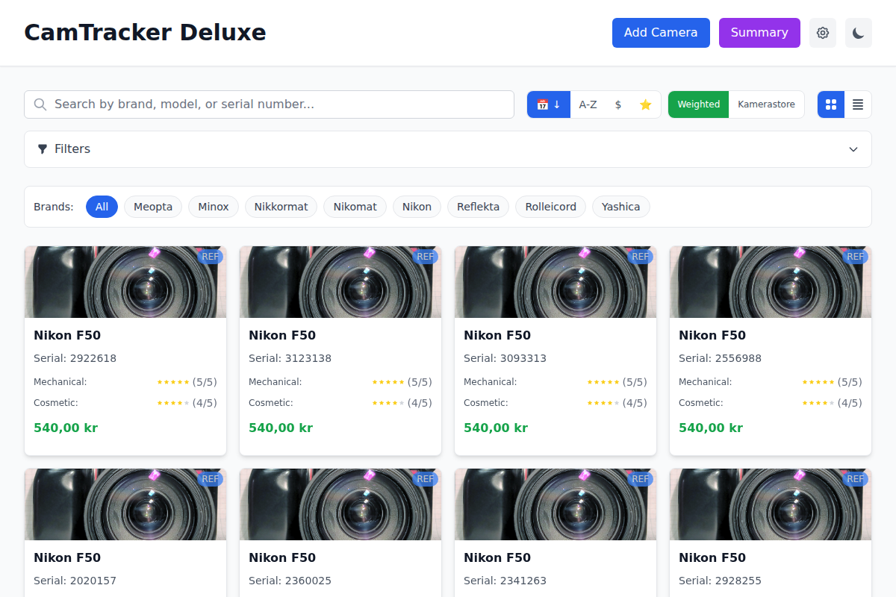
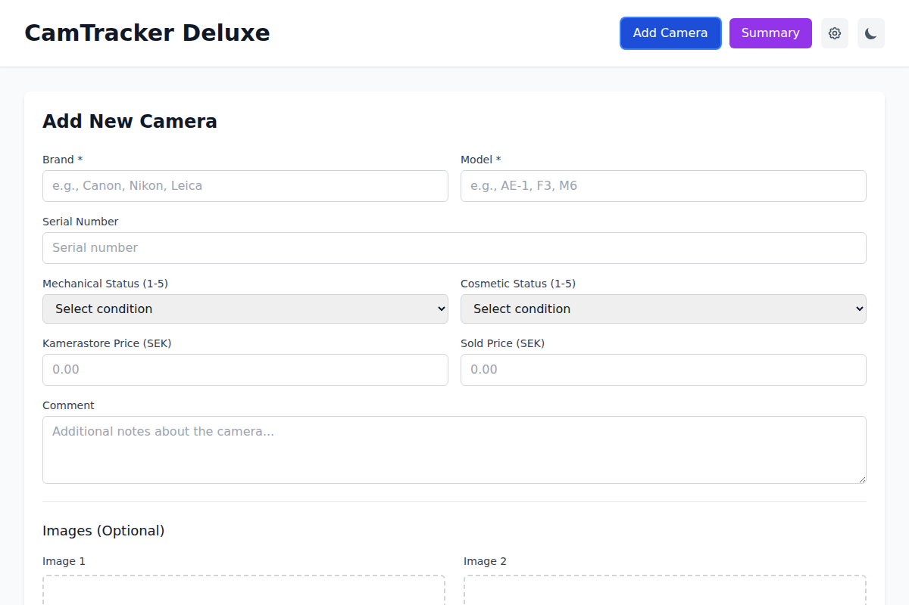
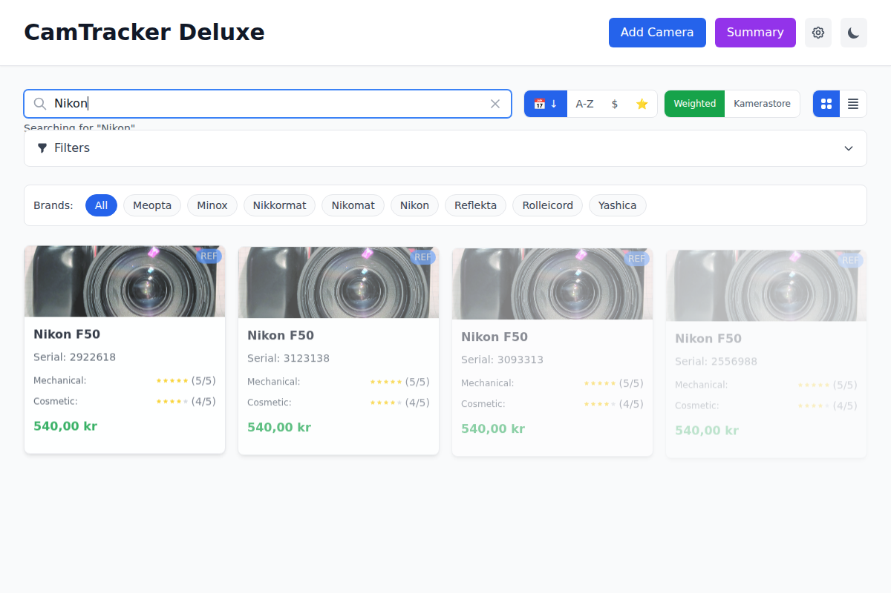
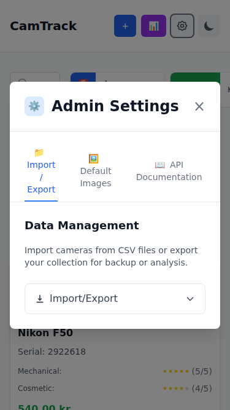

# CamTracker Deluxe Quick Start Guide

Get up and running with CamTracker Deluxe in just a few minutes!

## 🚀 Getting Started

### 1. Launch the Application
- Start the servers: Run `./start-dev.sh` from the project root
- Open your browser: Navigate to `http://localhost:5173`
- Ready to use: The application loads with an empty collection



### 2. Add Your First Camera
- Click the **"Add Camera"** button in the top-right corner
- Fill in the required fields: **Brand** and **Model**
- Add optional details: Serial number, condition ratings, prices
- Click **"Add Camera"** to save



### 3. Search and Filter
- Use the **search bar** to find cameras instantly
- Try searching for "Nikon" or any brand you've added
- Results filter automatically as you type



## 💡 Essential Features

### Quick Actions
- **🔍 Add Camera**: Create new entries
- **📊 Summary**: View collection statistics  
- **⚙️ Settings**: Access admin features
- **🌙/☀️ Theme**: Toggle dark/light mode

### View Options
- **Grid View**: Visual card layout (default)
- **List View**: Compact horizontal display
- **Sort Options**: By date, brand, model, or price

### Data Management
- **Import CSV**: Bulk add cameras from spreadsheet
- **Export CSV**: Download complete collection backup
- **Search**: Real-time filtering across all fields

## 📱 Works Everywhere



CamTracker Deluxe adapts to any device:
- **Desktop**: Full feature set with multiple columns
- **Tablet**: Optimized 2-3 column layout
- **Mobile**: Touch-friendly single column design

## 🔧 Pro Tips

### Data Entry
- **Required**: Brand and Model only
- **Recommended**: Add serial numbers for identification
- **Condition ratings**: Help track camera health (1-5 stars)
- **Comments**: Store purchase details and notes

### Organization
- **Use consistent naming**: "Canon AE-1" not "canon ae1"
- **Regular backups**: Export CSV files monthly
- **Image uploads**: Add 1-2 photos per camera (5MB max)
- **Filter actively**: Use search for large collections

### Advanced Features
- **Admin Settings**: Access import/export and system tools
- **API Documentation**: Complete integration documentation
- **Dark Mode**: Professional theme for low-light use
- **Responsive Design**: Same features on all screen sizes

## 📊 Sample Data

Want to try the features? Import this sample CSV:

```csv
Brand,Model,Serial,Mechanical,Cosmetic,Kamerastore,Weighted Price,Sold Price,Comment
Nikon,F50,2922618,5,4,600,540,540,Excellent condition with original box
Canon,AE-1,1234567,4,3,150,105,120,Classic 35mm SLR camera
Pentax,K1000,7891011,5,5,200,200,180,Perfect student camera
Olympus,OM-1,5551234,3,2,180,108,150,Needs some cleaning but functional
```

1. Copy the text above to a file named `sample-cameras.csv`
2. Go to **Settings > Import/Export**
3. Click **"Choose File"** and select your CSV
4. Click **"Import CSV"** and watch your collection populate!

## 🆘 Need Help?

### Common Issues
- **Can't find search?** Look for the search bar in the header
- **Add button not working?** Make sure Brand and Model are filled
- **Images not uploading?** Check file size (5MB max) and format (JPG/PNG)
- **Missing features?** Try refreshing the page or clearing browser cache

### Documentation
- **Complete User Guide**: `docs/USER-GUIDE.md` for detailed instructions
- **API Documentation**: Access via Settings > API Documentation
- **Postman Collections**: In `/postman/` folder for API testing

### Support
- Check the documentation first
- Look for similar issues in troubleshooting section
- Most problems are covered in the full User Guide

---

**Ready to manage your camera collection like a pro?** Start adding cameras and explore the features at your own pace. CamTracker Deluxe grows with your collection!

*Full documentation available in `docs/USER-GUIDE.md`*