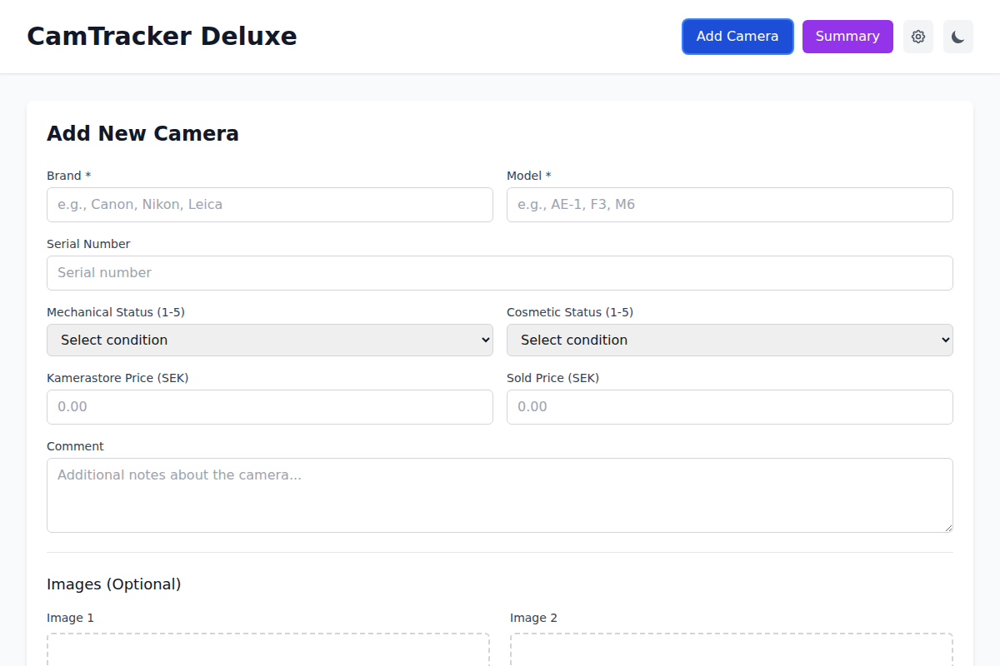
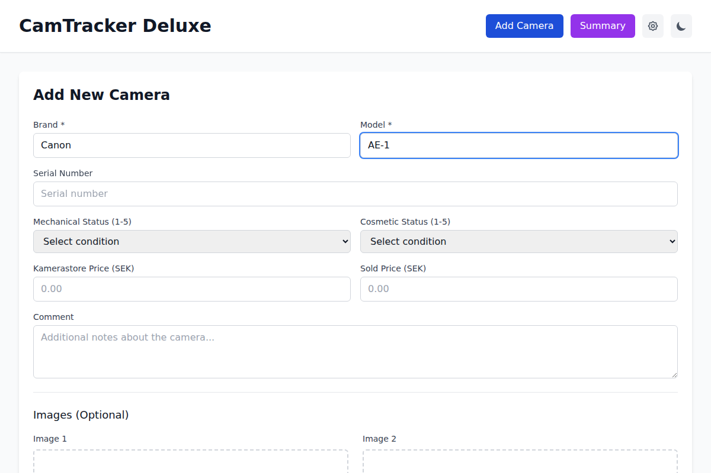
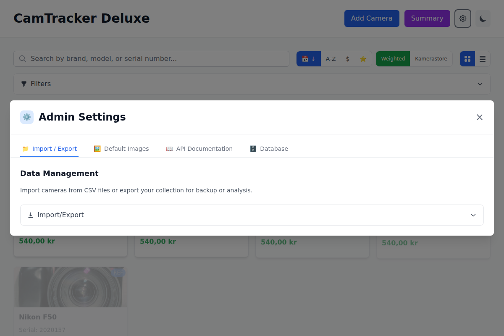

# CamTracker Deluxe Documentation

Welcome to the complete documentation for CamTracker Deluxe - your professional camera collection management system.

## 📚 Documentation Overview

### For Users
- **[Quick Start Guide](QUICK-START.md)** - Get started in 5 minutes
- **[Complete User Guide](USER-GUIDE.md)** - Comprehensive feature documentation with screenshots
- **[Screenshots Gallery](screenshots/)** - Visual reference of all application features

### For Developers
- **[API Documentation](API.md)** - Complete REST API reference
- **[Interactive API Docs](http://localhost:3000/api/docs)** - Swagger UI (when server running)
- **[OpenAPI Specification](openapi.yaml)** - Machine-readable API definition

### For Testing
- **[Postman Collections](../postman/)** - API testing and examples
- **[Test Suites](../server/tests/)** - Automated backend tests
- **[Frontend Tests](../client/src/)** - Component and integration tests

## 🚀 Getting Started

### New Users
1. **Start here**: [Quick Start Guide](QUICK-START.md)
2. **Learn features**: [User Guide](USER-GUIDE.md)
3. **View examples**: [Screenshots Gallery](screenshots/)

### Developers
1. **Understand the API**: [API Documentation](API.md)
2. **Interactive testing**: [Swagger UI](http://localhost:3000/api/docs)
3. **Integration examples**: [Postman Collections](../postman/)

### System Administrators  
1. **Installation**: See project root `CLAUDE.md`
2. **Configuration**: [API Documentation](API.md)
3. **Backup strategies**: [User Guide - Troubleshooting](USER-GUIDE.md#troubleshooting)

## 📖 Documentation Structure

```
docs/
├── README.md                 # This file - documentation overview
├── QUICK-START.md           # 5-minute getting started guide
├── USER-GUIDE.md            # Complete user documentation
├── API.md                   # Technical API reference
├── openapi.yaml             # OpenAPI 3.0 specification
└── screenshots/             # Application screenshots
    ├── 01-main-dashboard.png
    ├── 02-search-functionality.png
    ├── 03-add-camera-form.png
    ├── 04-add-camera-filled.png
    ├── 05-admin-settings.png
    └── 07-mobile-view.png
```

## 🖼️ Screenshots Gallery

Visual reference for all major application features:

| Feature | Screenshot | Description |
|---------|------------|-------------|
| **Main Dashboard** |  | Primary application interface with camera grid |
| **Search** |  | Real-time search and filtering |
| **Add Camera** |  | Camera creation form |
| **Form Filled** |  | Example of completed camera entry |
| **Admin Settings** |  | Administrative features and API docs |
| **Mobile View** |  | Responsive mobile interface |

## 🔧 Features Covered

### User Features
- ✅ **Camera Management** - Add, edit, delete, view cameras
- ✅ **Search & Filtering** - Real-time search with advanced filters
- ✅ **Image Management** - Upload and display camera photos
- ✅ **Data Import/Export** - CSV import/export with validation
- ✅ **Statistics** - Collection analytics and summaries
- ✅ **Responsive Design** - Works on desktop, tablet, mobile
- ✅ **Dark Mode** - Professional dark theme option

### Technical Features
- ✅ **REST API** - Complete programmatic access
- ✅ **OpenAPI Documentation** - Industry-standard API docs
- ✅ **Interactive Testing** - Swagger UI integration
- ✅ **Data Validation** - Comprehensive input validation
- ✅ **Error Handling** - User-friendly error messages
- ✅ **Performance Optimization** - Caching and optimization

### Administrative Features
- ✅ **Database Management** - Backup, clear, statistics
- ✅ **Cache Control** - Image cache management
- ✅ **Performance Monitoring** - System health metrics
- ✅ **API Access** - Complete administrative API
- ✅ **Default Images** - Reference image management
- ✅ **Job Processing** - Background task management

## 📱 Supported Platforms

### Web Browsers
- **Chrome** 90+ (Recommended)
- **Firefox** 88+
- **Safari** 14+
- **Edge** 90+

### Mobile Devices
- **iOS Safari** 14+
- **Android Chrome** 90+
- **Progressive Web App** support
- **Touch-optimized** interface

### Screen Sizes
- **Mobile**: 320px - 640px
- **Tablet**: 640px - 1024px  
- **Desktop**: 1024px+
- **Large Desktop**: 1440px+

## 🛠️ Integration Options

### API Integration
- **REST API** with OpenAPI 3.0 specification
- **JSON responses** with comprehensive error handling
- **File uploads** via multipart/form-data
- **Search and filtering** via query parameters

### Data Formats
- **CSV Import/Export** for bulk operations
- **JSON API** responses for programmatic access
- **Image uploads** (JPEG, PNG up to 5MB)
- **Unicode support** for international characters

### Development Tools
- **Postman Collections** for API testing
- **Swagger UI** for interactive documentation
- **Jest test suites** for backend testing
- **Vitest test suites** for frontend testing

## 📈 Version Information

- **Current Version**: 1.0.0
- **Release Date**: January 2024
- **Documentation Updated**: $(date)
- **API Version**: 1.0.0

## 🔗 Quick Links

### Live Documentation (Server Required)
- [Interactive API Explorer](http://localhost:3000/api/docs) - Swagger UI
- [Clean API Docs](http://localhost:3000/api/docs/redoc) - Redoc format
- [API Specification JSON](http://localhost:3000/api/docs/openapi.json)
- [API Specification YAML](http://localhost:3000/api/docs/openapi.yaml)

### Local Files
- [Complete User Guide](USER-GUIDE.md)
- [Quick Start Guide](QUICK-START.md)
- [API Reference](API.md)
- [Postman Collections](../postman/README.md)

## 🆘 Getting Help

### Documentation Issues
1. **Check this overview** for the right documentation
2. **Use the search feature** in your browser (Ctrl+F)
3. **Look at screenshots** for visual reference
4. **Try the interactive docs** for API questions

### Application Issues
1. **Start with Quick Start** for basic setup
2. **Check User Guide troubleshooting** section
3. **Review API documentation** for integration issues
4. **Test with Postman** for API problems

### Feature Requests
- Review the complete User Guide to see if feature exists
- Check API documentation for programmatic solutions
- Look at the project roadmap in main documentation

---

**Choose your path:**
- 🆕 **New to CamTracker?** → [Quick Start Guide](QUICK-START.md)
- 📖 **Need detailed help?** → [Complete User Guide](USER-GUIDE.md)  
- 🔧 **Building integrations?** → [API Documentation](API.md)
- 🖼️ **Want visual reference?** → [Screenshots Gallery](screenshots/)

*Happy camera collecting! 📸*