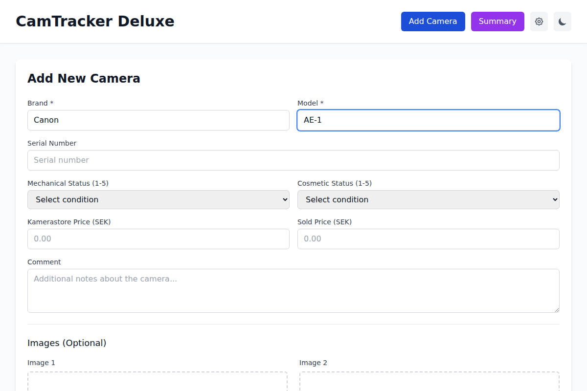
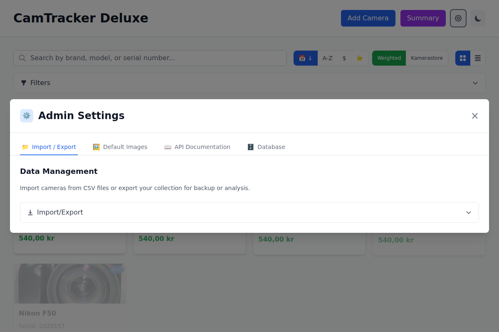

# CamTracker Deluxe User Guide

Welcome to **CamTracker Deluxe** - your comprehensive solution for managing vintage analog camera collections with professional-grade features and modern usability.

## Table of Contents

1. [Getting Started](#getting-started)
2. [Main Dashboard Overview](#main-dashboard-overview)
3. [Adding New Cameras](#adding-new-cameras)
4. [Managing Your Collection](#managing-your-collection)
5. [Search and Filtering](#search-and-filtering)
6. [View Modes and Display Options](#view-modes-and-display-options)
7. [Collection Statistics and Analytics](#collection-statistics-and-analytics)
8. [Import and Export Data](#import-and-export-data)
9. [Administrative Features](#administrative-features)
10. [Mobile and Responsive Design](#mobile-and-responsive-design)
11. [Tips and Best Practices](#tips-and-best-practices)
12. [Troubleshooting](#troubleshooting)

---

## Getting Started

### System Requirements
- Modern web browser (Chrome, Firefox, Safari, Edge)
- Internet connection for initial setup
- JavaScript enabled

### First Launch
1. Start the application servers (backend and frontend)
2. Navigate to `http://localhost:5173` in your web browser
3. The application will load with an empty collection ready for your cameras

---

## Main Dashboard Overview


The main dashboard is your central hub for camera collection management. Here's what you'll see:

### Header Section
- **Application Title**: "CamTracker Deluxe" (desktop) / "CamTrack" (mobile)
- **Action Buttons**: 
  - 🔍 **Add Camera**: Create new camera entries
  - 📊 **Summary**: View collection statistics
  - ⚙️ **Admin Settings**: Access advanced features
- **Theme Toggle**: Switch between light and dark modes
- **Search Bar**: Quick search across your collection

### Main Content Area
- **Camera Grid/List**: Visual display of your camera collection
- **Filter Panel**: Advanced filtering options (collapsible)
- **View Controls**: Toggle between grid and list views
- **Sort Options**: Organize cameras by date, brand, model, or price

### Key Features at a Glance
- **Real-time Search**: Find cameras instantly as you type
- **Responsive Design**: Adapts to desktop, tablet, and mobile devices
- **Dark Mode Support**: Easy on the eyes with professional dark theme
- **Professional UI**: Clean, modern interface designed for efficiency

---

## Adding New Cameras


Adding cameras to your collection is straightforward with our comprehensive form system.

### Step 1: Open the Add Camera Form
1. Click the **"Add Camera"** button in the top-right corner
2. The form will open with all necessary fields

### Step 2: Fill in Basic Information


**Required Fields:**
- **Brand**: Camera manufacturer (e.g., "Canon", "Nikon", "Leica")
- **Model**: Specific camera model (e.g., "AE-1", "F50", "M3")

**Optional Fields:**
- **Serial Number**: Unique identifier for your specific camera
- **Mechanical Condition**: Rate 1-5 stars for mechanical functionality
- **Cosmetic Condition**: Rate 1-5 stars for physical appearance
- **Kamerastore Price**: Reference price from Kamerastore (€)
- **Sold Price**: Actual price paid or sold for (€)
- **Comments**: Additional notes, purchase details, or observations

### Step 3: Add Images (Optional)
- **Upload up to 2 images** per camera
- **Supported formats**: JPEG, PNG
- **File size limit**: 5MB per image
- **Recommended**: Front view and detailed shots

### Step 4: Save Your Camera
- Click **"Add Camera"** to save
- The system automatically calculates the **weighted price** based on condition
- Your camera appears immediately in the main collection view

### Weighted Price Calculation
The system automatically calculates a weighted price using this formula:
```
Weighted Price = Kamerastore Price × (0.2 + ((Mechanical + Cosmetic) / 2 - 1) × 0.2)
```

**Examples:**
- Perfect condition (5/5): 90% of Kamerastore price
- Good condition (3/3): 60% of Kamerastore price
- Poor condition (1/1): 20% of Kamerastore price

---

## Managing Your Collection

### Viewing Camera Details
- **Click any camera card** to view detailed information
- See full specifications, images, and purchase history
- Quick access to edit or delete options

### Editing Cameras
1. Click the **"Edit"** button on any camera card
2. Modify any field in the form
3. **"Update Camera"** saves changes instantly
4. Weighted price recalculates automatically

### Deleting Cameras
1. Click the **"Delete"** button on any camera card
2. **Confirm deletion** in the dialog box
3. Camera and associated images are permanently removed

### Bulk Operations
- **Import from CSV**: Add multiple cameras at once
- **Export to CSV**: Backup your entire collection
- **Clear Database**: Remove all cameras (development/testing)

---

## Search and Filtering


CamTracker Deluxe offers powerful search and filtering capabilities to help you find exactly what you're looking for.

### Quick Search
- **Real-time search** with 300ms debouncing
- **Search across**: Brand, model, serial number, and comments
- **Instant results**: Cameras filter as you type
- **Clear search**: Remove text to show all cameras

### Advanced Filtering
Access the filter panel to narrow down your collection:

**Price Range Filtering:**
- Set minimum and maximum price limits
- Filter by Kamerastore price or sold price
- Perfect for budget planning or value analysis

**Condition Filtering:**
- Filter by mechanical condition rating
- Filter by cosmetic condition rating
- Find cameras needing attention or in perfect condition

**Brand Filtering:**
- **Dynamic brand list**: Automatically generated from your collection
- **Click brand buttons** to filter instantly
- **Multiple brand selection**: Combine filters as needed

### Search Tips
- **Use partial matches**: "Nik" will find all Nikon cameras
- **Search serial numbers**: Find specific camera instances
- **Combine filters**: Use brand + price range for targeted results
- **Save searches**: Bookmark URLs with active filters

---

## View Modes and Display Options

CamTracker Deluxe adapts to your preferred viewing style with multiple display options.

### Grid View (Default)
- **Responsive columns**: 1-5 columns based on screen size
- **Visual card layout**: Large images with key information
- **Hover effects**: Professional interactions and animations
- **Optimal for**: Browsing and visual identification

### List View
- **Compact horizontal layout**: Maximum 2 rows per camera
- **Dense information display**: More cameras visible at once
- **Quick scanning**: Ideal for large collections
- **Optimal for**: Detailed comparisons and inventory management

### Sort Options
**Sort by:**
- **Date Added**: Newest or oldest first (default)
- **Brand**: Alphabetical brand sorting
- **Model**: Alphabetical model sorting
- **Price**: Lowest to highest or highest to lowest

**Sort Order:**
- **Ascending**: A-Z, low to high, oldest to newest
- **Descending**: Z-A, high to low, newest to oldest

### Display Preferences
- **Persistent settings**: Your view mode saves automatically
- **Theme switching**: Light/dark mode with smooth transitions
- **Responsive breakpoints**: Automatically adjusts for screen size

---

## Collection Statistics and Analytics



Get insights into your collection with comprehensive statistics and analytics.

### Summary Dashboard
Access via the **"Summary"** button in the header to see:

**Collection Overview:**
- **Total Cameras**: Complete count of your collection
- **Total Value**: Combined worth based on weighted prices
- **Average Value**: Mean camera value
- **Recent Additions**: Cameras added in the last 30 days

**Condition Analysis:**
- **Average Mechanical Condition**: Overall mechanical health
- **Average Cosmetic Condition**: Overall cosmetic state
- **Condition Distribution**: Breakdown by condition ratings
- **Cameras Needing Attention**: Below-average condition items

**Brand Distribution:**
- **Top Brands**: Most represented manufacturers
- **Brand Statistics**: Count and total value per brand
- **Collection Diversity**: Brand variety analysis
- **Investment Concentration**: Value distribution across brands

**Price Analysis:**
- **Price Ranges**: Distribution across value brackets
- **Most/Least Expensive**: Collection extremes
- **Investment Tracking**: Purchase vs. current value
- **Market Trends**: Value changes over time

### Export Analytics
- **CSV Export**: Download complete collection data
- **Custom Reports**: Filter and export specific segments
- **Backup Data**: Regular exports for data protection

---

## Import and Export Data

Manage your data with professional import/export capabilities.

### CSV Import
**Prepare Your Data:**
1. Use the provided CSV template format
2. Required columns: Brand, Model
3. Optional columns: Serial, Mechanical, Cosmetic, Kamerastore Price, Sold Price, Comment

**Import Process:**
1. Navigate to **Admin Settings > Import/Export**
2. Click **"Choose File"** and select your CSV
3. **Validation occurs** before any data is imported
4. **Review results**: See successful imports and any errors
5. **Error reporting**: Detailed feedback for problematic rows

**Sample CSV Format:**
```csv
Brand,Model,Serial,Mechanical,Cosmetic,Kamerastore,Weighted Price,Sold Price,Comment
Nikon,F50,2922618,5,4,600,540,540,Excellent condition with original box
Canon,AE-1,1234567,4,3,150,105,120,Classic 35mm SLR camera
Pentax,K1000,7891011,5,5,200,200,180,Perfect student camera
```

### CSV Export
**Export Your Collection:**
1. Navigate to **Admin Settings > Import/Export**
2. Click **"Export CSV"** 
3. **Automatic download** starts immediately
4. **Complete data**: All fields and calculated values included
5. **Filename format**: `cameras_export_YYYYMMDD.csv`

**Export Features:**
- **Complete data integrity**: All information preserved
- **Calculated fields included**: Weighted prices and timestamps
- **Reimport compatibility**: Exported files can be imported back
- **Backup scheduling**: Regular exports recommended

---

## Administrative Features


Access advanced features through the Admin Settings panel.

### Import/Export Management
- **CSV Import**: Bulk add cameras from spreadsheets
- **CSV Export**: Backup and analyze your collection data
- **Data Validation**: Comprehensive error checking and reporting
- **Progress Tracking**: Real-time import/export status

### Default Image System
- **Reference Images**: Manage default camera images
- **Wikipedia Integration**: Automatic image sourcing
- **Cache Management**: Optimize performance and storage
- **Attribution Tracking**: Proper image source credits

### API Documentation
- **Interactive Explorer**: Test API endpoints directly
- **Complete Documentation**: All endpoints and parameters
- **Code Examples**: Integration samples in multiple languages
- **Download Specifications**: OpenAPI/Swagger format

### Database Operations
**Development Tools:**
- **Clear All Cameras**: Reset collection (development only)
- **Database Statistics**: Collection health and metrics
- **Performance Monitoring**: System optimization insights

**⚠️ Safety Features:**
- **Confirmation dialogs**: Prevent accidental data loss
- **Development-only operations**: Protected dangerous functions
- **Backup reminders**: Regular export recommendations

---

## Mobile and Responsive Design


CamTracker Deluxe is fully optimized for mobile devices and tablets.

### Mobile-First Design
- **Touch-friendly interface**: Large buttons and touch targets
- **Swipe gestures**: Intuitive navigation and interactions
- **Responsive typography**: Readable text at all sizes
- **Optimized loading**: Fast performance on mobile connections

### Adaptive Layout
**Screen Size Breakpoints:**
- **Mobile (< 640px)**: Single column, compact header
- **Tablet (640px - 1024px)**: 2-3 columns, medium density
- **Desktop (> 1024px)**: 3-5 columns, full feature set

**Mobile-Specific Features:**
- **Condensed title**: "CamTrack" instead of "CamTracker Deluxe"
- **Icon buttons**: Space-efficient navigation
- **Collapsible sections**: Expandable filter panels
- **Touch-optimized forms**: Large input fields and buttons

### Cross-Platform Compatibility
- **iOS Safari**: Optimized for iPhone and iPad
- **Android Chrome**: Perfect on all Android devices
- **Progressive Web App**: Add to home screen capability
- **Offline Support**: Basic functionality without internet

---

## Tips and Best Practices

### Data Entry Best Practices
**Camera Information:**
- **Consistent naming**: Use standard brand/model names
- **Complete serial numbers**: Aid in identification and insurance
- **Honest condition ratings**: Maintain accurate valuations
- **Detailed comments**: Include purchase source, date, and observations

**Image Management:**
- **Quality photos**: Clear, well-lit images work best
- **Multiple angles**: Front view + detail shots recommended
- **Consistent lighting**: Helps with visual consistency
- **File organization**: Keep original high-res versions separately

### Collection Management
**Regular Maintenance:**
- **Weekly reviews**: Update condition ratings as needed
- **Monthly backups**: Export CSV files regularly
- **Annual valuations**: Review and update Kamerastore prices
- **Insurance documentation**: Keep exported CSV for insurance

**Growth Planning:**
- **Budget tracking**: Use price filters to plan purchases
- **Condition targets**: Identify cameras needing restoration
- **Collection gaps**: Use brand filters to see what's missing
- **Investment analysis**: Monitor value trends over time

### Performance Optimization
**Large Collections (100+ cameras):**
- **Use filters actively**: Reduce displayed items for faster loading
- **Regular image cleanup**: Remove unused files periodically
- **Export regularly**: Maintain data backups
- **Search strategically**: Use specific terms rather than browsing

---

## Troubleshooting

### Common Issues and Solutions

**Application Won't Load:**
- **Check server status**: Ensure both backend and frontend are running
- **Clear browser cache**: Refresh with Ctrl+Shift+R (Cmd+Shift+R on Mac)
- **Check network**: Verify internet connection for initial setup
- **Disable browser extensions**: Some ad blockers may interfere

**Images Not Displaying:**
- **Check file format**: Only JPEG and PNG are supported
- **Verify file size**: Must be under 5MB per image
- **Clear image cache**: Admin Settings > Cache > Clear Cache
- **Reload page**: Force refresh to reload cached images

**Search Not Working:**
- **Check spelling**: Verify search terms are correct
- **Clear filters**: Remove active filters that might hide results
- **Refresh page**: Reload to reset search state
- **Check data**: Ensure cameras have searchable content

**Import/Export Problems:**
- **CSV format**: Ensure file matches expected column structure
- **File encoding**: Use UTF-8 encoding for international characters
- **Check file size**: Very large files may timeout
- **Review error messages**: Import provides detailed error reports

### Performance Issues

**Slow Loading:**
- **Reduce view**: Switch to list view for large collections
- **Clear cache**: Remove cached images and data
- **Close other tabs**: Free up browser memory
- **Restart application**: Stop and start servers

**Memory Issues:**
- **Large collections**: Consider paginating or filtering
- **Image optimization**: Compress images before upload
- **Browser limits**: Some browsers limit local storage
- **Regular cleanup**: Export and clear old data periodically

### Data Recovery

**Lost Data:**
- **Check exports**: Look for recent CSV backup files
- **Browser storage**: Data may be in localStorage
- **Server logs**: Check backend logs for clues
- **Contact support**: Provide error details for assistance

**Backup Strategy:**
1. **Weekly CSV exports**: Automatic backup routine
2. **Image folder backup**: Copy /uploads/cameras/ directory
3. **Database backup**: SQLite file in /server/database/
4. **Version control**: Track changes if using Git

### Getting Help

**Documentation Resources:**
- **This User Guide**: Comprehensive feature documentation
- **API Documentation**: Technical integration details
- **Postman Collections**: API testing and examples
- **Source Code**: Full application code available

**Support Channels:**
- **GitHub Issues**: Report bugs and feature requests
- **Documentation**: Check all guides before asking
- **Community**: Share tips and solutions with other users
- **Self-Help**: Most issues are covered in troubleshooting

---

## Advanced Features

### API Integration
CamTracker Deluxe provides a complete REST API for integration with other tools:

- **Complete CRUD operations**: Full programmatic access
- **Search and filtering**: All UI functionality available via API
- **Batch operations**: Import/export via API calls
- **Real-time updates**: Webhook support for external systems

Access the interactive API documentation through **Admin Settings > API Documentation**.

### Customization Options
**Theme Customization:**
- **Dark/Light modes**: Built-in theme switching
- **Color preferences**: Consistent throughout the application
- **Responsive design**: Adapts to all screen sizes
- **Professional styling**: Modern, clean interface design

**Data Customization:**
- **Flexible fields**: Most camera attributes are optional
- **Custom comments**: Unlimited text for additional details
- **Extensible structure**: Ready for future feature additions
- **Import flexibility**: Handles various CSV formats

### Future Enhancements
CamTracker Deluxe is designed for extensibility:

- **Multi-user support**: User accounts and permissions
- **Cloud synchronization**: Backup to cloud services
- **Advanced analytics**: Trend analysis and reporting
- **Mobile apps**: Native iOS and Android applications
- **Marketplace integration**: Price monitoring and alerts
- **Insurance integration**: Automatic valuation updates

---

## Conclusion

CamTracker Deluxe provides a professional, comprehensive solution for vintage camera collection management. With its intuitive interface, powerful features, and robust data management capabilities, it's designed to grow with your collection and provide lasting value.

**Key Benefits:**
- ✅ **Professional Interface**: Clean, modern design
- ✅ **Complete Feature Set**: Everything needed for collection management
- ✅ **Data Security**: Multiple backup and export options
- ✅ **Responsive Design**: Works on all devices
- ✅ **Extensible Architecture**: Ready for future enhancements
- ✅ **Open Source**: Full control and transparency

**Getting the Most Value:**
1. **Start small**: Add a few cameras to learn the interface
2. **Import bulk data**: Use CSV import for existing collections
3. **Regular maintenance**: Keep data current and backed up
4. **Explore features**: Try all view modes and filtering options
5. **Share feedback**: Help improve the application for everyone

Whether you're a casual collector or a serious enthusiast, CamTracker Deluxe provides the tools you need to organize, analyze, and enjoy your vintage camera collection.

---

*Last updated: $(date)*  
*Version: 1.0.0*  
*For technical support and updates, visit the project repository.*